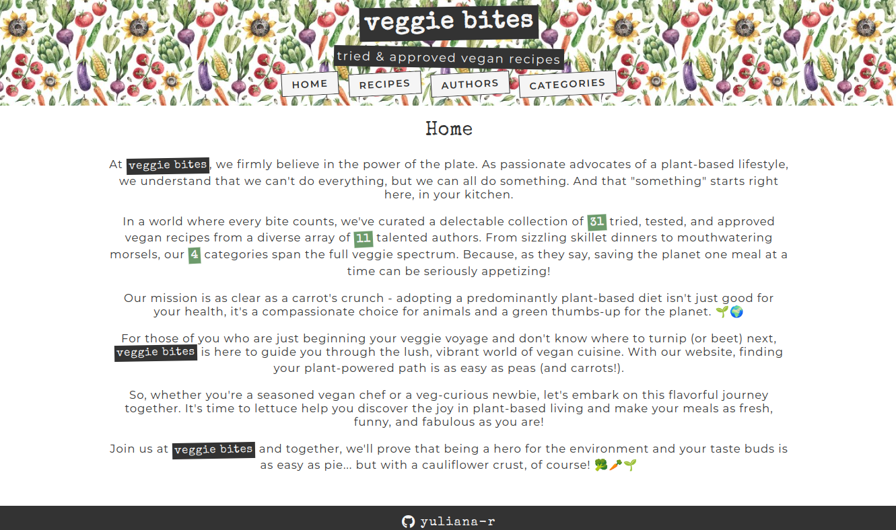

# Inventory App
## Introduction

This project is a vegan recipes library with ability to browse, create, update and delete recipes, authors and categories.

This project primarily demonstrates use of NodeJS/ExpressJS, MongoDB (& mongoose), EJS and the MVC model.

## Preview

## Media & assets credits:

1. Flaticon (Pixel perfect): https://www.flaticon.com/free-icons/leaf

2. Freepik (art.shcherbyna): https://www.freepik.com/premium-vector/farm-vegetables-fruits-watercolor-pattern-seamless-background-with-handdrawn-organic-products_27402407.htm
