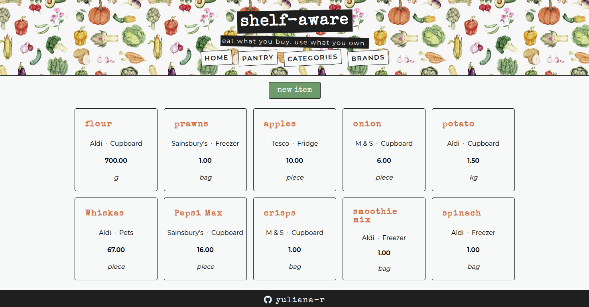

# Inventory app

## Introduction

This project is a pantry/inventory tracker with ability to browse, create, update and delete items, brands and categories.

This project primarily demonstrates use of NodeJS/ExpressJS, PotsgreSQL, EJS and the MVC model.

## Preview

## Media & assets credits

1. Flaticon (MindWorlds): <https://www.flaticon.com/free-icon/shelf_11030933>

2. Freepik (rawpixel.com): <https://www.freepik.com/free-vector/hand-drawn-vegetable-collection-vector_2782474.htm>
